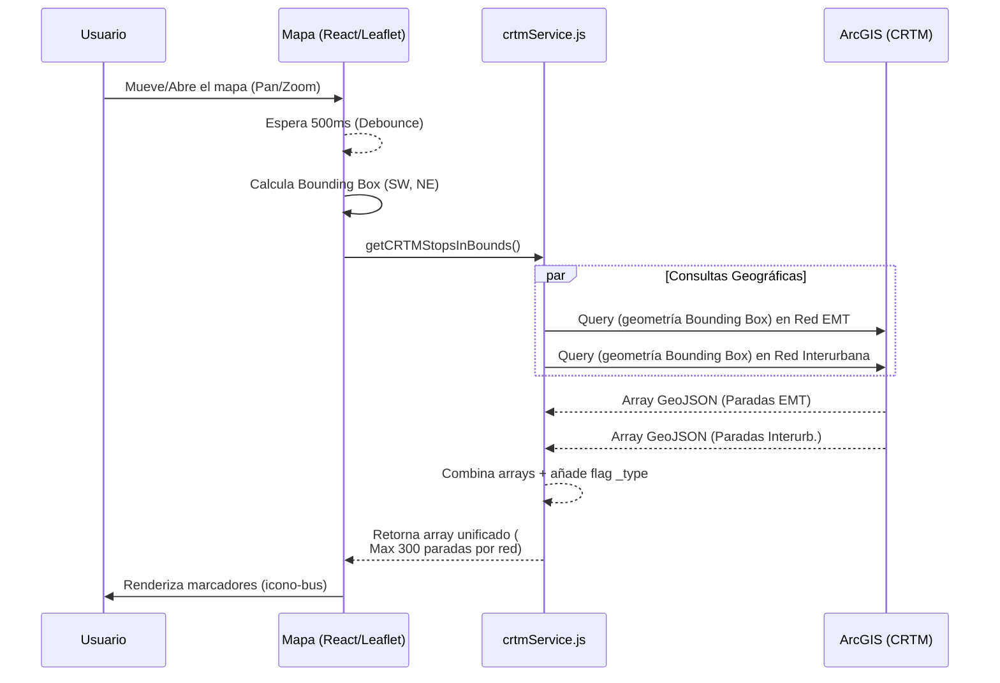
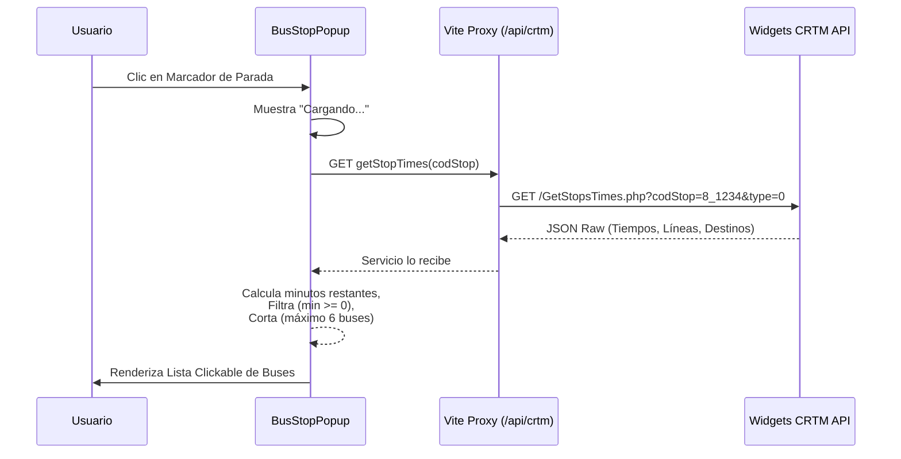
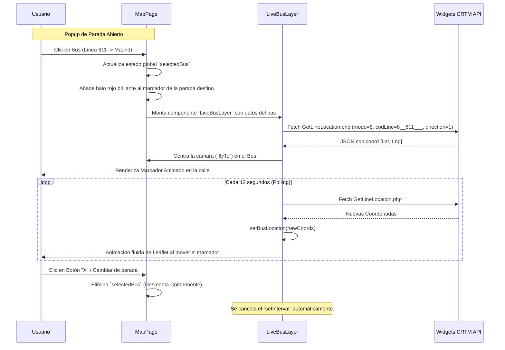

# Documentación de Integración CRTM: Paradas, Tiempos y Rastreo en Vivo

Este documento detalla la arquitectura técnica y los flujos de datos que hacen posible la visualización de paradas, la consulta de tiempos de llegada y el rastreo en tiempo real de autobuses en la aplicación Quick Arrival, utilizando la infraestructura de datos abiertos y la API de Widgets del Consorcio Regional de Transportes de Madrid (CRTM).

---

## 1. Arquitectura de Fuentes de Datos

La aplicación consume datos del CRTM desde dos fuentes principales, sin necesidad de autenticación, pero empleando un **Proxy en Vite** para saltar las restricciones de CORS del navegador.

1. **ArcGIS REST Services (Datos Estáticos/Geográficos)**:
   - *Propósito*: Obtener la ubicación geográfica de postes y marquesinas.
   - *Dominio*: `datos-crtm.opendata.arcgis.com`
   - *Endpoints*:
     - Paradas Interurbanas: `M8_Red/FeatureServer/0/query`
     - Paradas Urbanas (EMT): `M6_Red/FeatureServer/0/query`

2. **CRTM Widgets API (Datos Dinámicos en Tiempo Real)**:
   - *Propósito*: Obtener los tiempos de espera y las coordenadas GPS activas de los vehículos.
   - *Dominio*: `www.crtm.es` (a través de `/api/crtm` proxy)
   - *Endpoints*:
     - Tiempos de parada: `widgets/api/GetStopsTimes.php`
     - Ubicación de línea: `widgets/api/GetLineLocation.php`

---

## 2. Flujo 1: Carga Dinámica de Paradas por Viewport

Para no saturar el navegador cargando las miles de paradas de Madrid simultáneamente, el mapa solo solicita las paradas que entran en la ventana visible (`viewport`).

**Lógica Clave:**
- Se usa `useMapEvents({ moveend: () })` de Leaflet para detectar cuándo el usuario deja de arrastrar el mapa.
- Se lee el "Bounding Box" (sureste y noroeste) de la vista.
- Se implementa un **Debounce de 500ms**: Si el usuario sigue moviéndose frenéticamente, se cancelan las peticiones antiguas y solo se lanza una cuando se detiene.

### Diagrama: Obtención de Paradas

---

## 3. Flujo 2: Tiempos de Llegada en Tiempo Real

Cuando un usuario interactúa con una parada física en el mapa, se requiere saber qué autobuses están en camino hacia ese punto exacto.

**Lógica Clave:**
- Se envía el `CODIGOESTACION` con su prefijo de red (ej: `8_06032` para interurbanos, `6_1234` para EMT).
- El servidor devuelve fechas absolutas ISO de llegada, que el frontend convierte inmediatamente a minutos relativos (`minutos = (Llegada - HoraActual) / 60000`).

### Diagrama: Tiempos de Llegada

---

## 4. Flujo 3: Rastreos GPS y Vehículos en Movimiento (Live Tracking)

El usuario selecciona un autobús específico ("Línea 611, Destino Madrid") de la lista de próximas llegadas para ver exactamente por qué calle viene.

**Lógica Clave:**
- **Auto-centrado inicial**: Tras el primer clic, el mapa hace un `flyTo` hacia la ubicación original devuelta por el bus.
- **Polling Híbrido**: En lugar de consultar al servidor descontroladamente, un `setInterval` en `LiveBusLayer` de 12 segundos pide las nuevas coordenadas para no ser bloqueados.
- **Resaltado Visual**: El marcador de la parada destino recibe la clase CSS `.active-bus-stop-marker` (anillo rojo pulsante) para diferenciarla, y el autobús un `.live-bus-marker` (halo azul pulsante) para indicar rastreo activo.

### Diagrama: Rastreo GPS Continuo

---

## 5. Resumen de Estados Clave Mutados (Hooks)

Dentro de `MapPage.jsx` destacan:
- `userLocation`: `[lat, lng]` - Gestionado por Geolocation API / `LocateControl`.
- `stops`: `[Array GeoJSON]` - Poblado post-movimiento de cámara y debouncing (Flujo 1).
- `selectedBus`: `Object | null` - El detonante del Modo de Monitoreo GPS (Flujo 3). Cuando es distinto de `null`, renderiza tanto el subcomponente `LiveBusLayer` como el panel inferior informativo.
