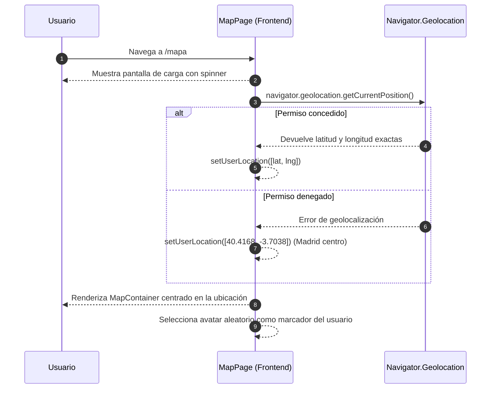
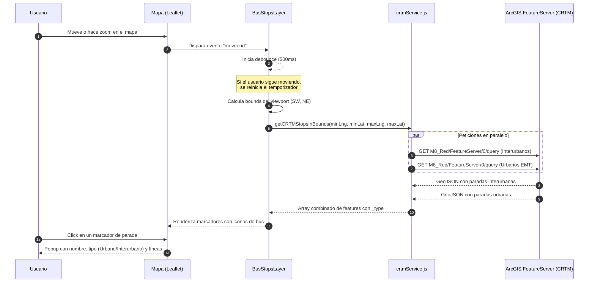
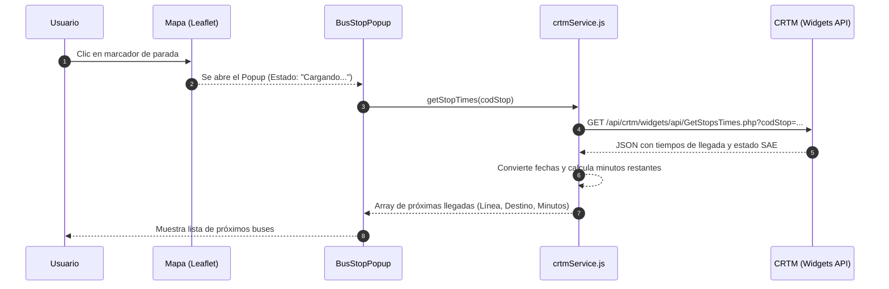
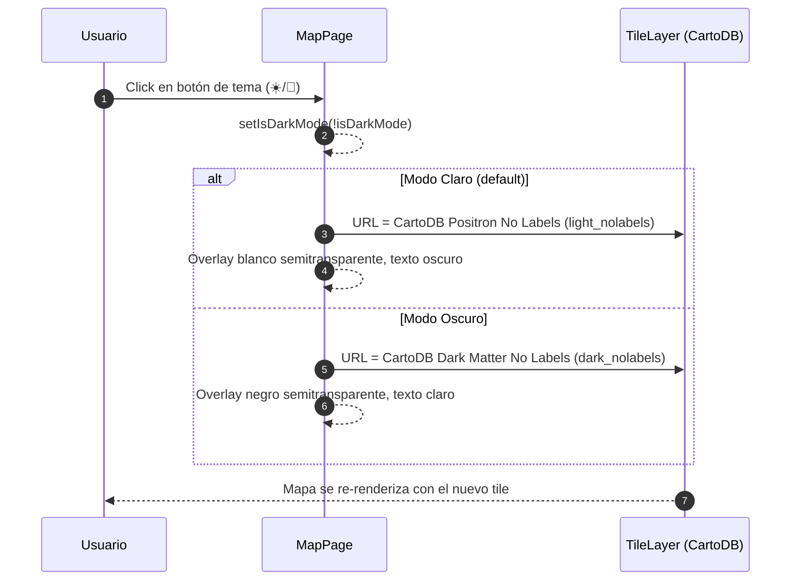

# Documentación del Mapa Interactivo - Quick Arrival

Este documento detalla el flujo completo del mapa interactivo implementado en la aplicación, incluyendo la visualización de la ubicación del usuario, la carga dinámica de paradas de autobuses desde el CRTM (Consorcio Regional de Transportes de Madrid) y el sistema de temas claro/oscuro.

## 1. Componentes Principales

- **`MapPage.jsx`**: Componente principal que integra `react-leaflet` y gestiona la geolocalización del usuario, el cambio de tema (light/dark), y la inyección de las capas del mapa (tiles, marcador del usuario, paradas de bus).
- **`BusStopsLayer`** *(sub-componente interno de MapPage)*: Escucha los eventos de movimiento del mapa (`moveend`), calcula los límites del viewport visible y solicita las paradas al CRTM con un debounce de 500ms para no saturar la API.
- **`ChangeView`** *(sub-componente interno de MapPage)*: Sincroniza el centro del mapa con la ubicación obtenida del usuario.
- **`crtmService.js`**: Servicio que se comunica con la API abierta del CRTM (ArcGIS FeatureServer) para obtener las paradas de autobuses urbanos e interurbanos de toda la Comunidad de Madrid.
- **`emtService.js`**: Servicio alternativo (actualmente no activo) que se comunica con la API REST de EMT Madrid para obtener paradas urbanas del municipio de Madrid. Utiliza autenticación con email y contraseña vía proxy de Vite.
- **`MapPage.css`**: Estilos del mapa, overlay, marcadores, popups y modo oscuro.

---

## 2. Flujo de Carga Inicial del Mapa

Al entrar en `/mapa`, la app solicita permisos de geolocalización. Si se conceden, centra el mapa en la ubicación exacta del usuario con un zoom alto (nivel 18). Si se deniega, se usa el centro de Madrid como fallback.



## 3. Flujo de Carga de Paradas de Bus (CRTM)

Cada vez que el usuario deja de mover o hacer zoom en el mapa, se dispara una petición al CRTM para obtener las paradas visibles. La petición tiene un debounce de 500ms para evitar solicitudes innecesarias.



## 4. Flujo de Tiempos de Llegada en Tiempo Real (CRTM)

Cuando un usuario hace clic en una parada mostrada en el mapa, el componente `BusStopPopup` realiza una petición asíncrona para obtener los tiempos reales de llegada de los próximos autobuses. Esta consulta se enruta mediante un proxy de Vite para evitar problemas de CORS y contacta con la API (no documentada públicamente) de Widgets del CRTM.



## 5. Endpoints del CRTM — Detalle Técnico

Los datos del CRTM provienen de dos servicios diferentes que operan sin autenticación: datos estáticos (Gis) y datos dinámicos (Tiempos).

### 5.1. Localización de Paradas (ArcGIS)

Se utilizan para localizar las marquesinas y postes, filtrando por el viewport visible:

| Red | Endpoint | Contenido |
|-----|----------|-----------|
| Interurbana | `M8_Red/FeatureServer/0` | Paradas de buses entre municipios |
| Urbana (EMT) | `M6_Red/FeatureServer/0` | Paradas de buses dentro de Madrid capital |

**Parámetros de la consulta:**

| Parámetro | Valor | Descripción |
|-----------|-------|-------------|
| `where` | `1=1` | Sin filtro por atributos (acepta todas) |
| `geometry` | `minLng,minLat,maxLng,maxLat` | Bounding box del viewport del mapa |
| `geometryType` | `esriGeometryEnvelope` | Tipo de geometría: rectángulo |
| `inSR` / `outSR` | `4326` | Sistema de coordenadas WGS84 (lat/lng) |
| `spatialRel` | `esriSpatialRelIntersects` | Paradas que intersectan con el rectángulo |
| `outFields` | `DENOMINACION,LINEAS,...` | Campos a devolver |
| `resultRecordCount` | `300` | Máximo de resultados por petición |
| `f` | `geojson` | Formato de respuesta: GeoJSON |

## 6. Flujo del Tema Claro/Oscuro

El mapa soporta dos temas visuales. El estado se gestiona con `useState` y afecta a los tiles del mapa, el overlay superior, los popups y la atribución.



## 7. Estructura de Archivos

```
src/
├── components/
│   └── map-page/
│       ├── MapPage.jsx       ← Componente principal del mapa
│       └── MapPage.css       ← Estilos (overlay, marcadores, dark mode)
├── services/
│   ├── crtmService.js        ← API del CRTM (ArcGIS, sin auth)
│   └── emtService.js         ← API de EMT Madrid (con auth, alternativa)
└── assets/
    ├── avatar/               ← 14 avatares aleatorios para el marcador del usuario
    ├── icono-bus3.jpg         ← Icono de las paradas de bus en el mapa
    ├── light-theme-icon.png   ← Icono del botón para cambiar a modo claro
    └── dark-theme-icon.png    ← Icono del botón para cambiar a modo oscuro
```

## 8. Notas Adicionales y Configuración

1. **Datos Abiertos del CRTM**:
   Los datos de paradas provienen del portal de datos abiertos del CRTM (ArcGIS FeatureServer). No requieren autenticación ni registro. Están disponibles bajo licencia abierta para reutilización.

2. **API de EMT Madrid (alternativa)**:
   El servicio `emtService.js` se conserva como alternativa para obtener paradas del municipio de Madrid con datos en tiempo real. Requiere credenciales almacenadas en `.env` (`VITE_EMT_EMAIL`, `VITE_EMT_PASSWORD`). Las peticiones se enrutan a través del proxy de Vite (`/api/emt`) para evitar restricciones de CORS.

3. **Optimización de Rendimiento**:
   El debounce de 500ms en el `BusStopsLayer` evita saturar la API con peticiones constantes al mover el mapa. Solo se solicitan las paradas dentro del viewport visible, limitadas a 300 resultados por consulta.

4. **Marcadores Personalizados**:
   El marcador del usuario utiliza uno de los 14 avatares disponibles, seleccionado aleatoriamente al cargar la página. Los marcadores de las paradas de bus usan un icono circular (`icono-bus3.jpg`) con sombra CSS.
